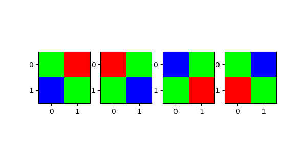

## Assignment 1

darkness = 150
 
saturation 4095
 
r_scale = 2.394531 , g_scale = 1.000000 , b_scale = 1.597656
  
- It is a 16 bit image (uint16 numpy array) of size size (4016, 6016). 
- The image has min value 147, max value 4087

### Linearization 

  I noticed a slight change in detail on the building the window edges are more clearly visible. It seems the darker shades are more discriminative perhaps because we clipped off some of the darkest values.  

### Bayer
I created the 4 bayer kernels, each of size (3, 2, 2) as follows: 
 
`
grbg = np.array([[[0, 1], [0, 0]], [[1, 0], [0, 1]], [[0, 0], [1, 0]]])
rggb = np.array([[[1, 0], [0, 0]], [[0, 1], [1, 0]], [[0, 0], [0, 1]]])
bggr = np.array([[[0, 0], [0, 1]], [[0, 1], [1, 0]], [[1, 0], [0, 0]]])
gbrg = np.array([[[0, 0], [1, 0]], [[1, 0], [0, 1]], [[0, 1], [0, 0]]])
`
 

<!--  -->

I take a transpose and convolved them with the top-left 2x2x3 patch in the extracted RGB-image (created from the linearized array before white balancing or demosaicing, this has 1/2 * original resolution). I summed the convolutions to get values:  
1. grbg = 0.16375158428390368
2. rggb = 0.1650190114068441
3. bggr = 0.17769328263624842
4. gbrg = 0.15640050697084917

- Since BGR has maximum value, I identify that as the Bayer pattern. If the top left corner was not used for this identification, other patterns could have also resulted comparable/better results.  

- After attempting demosaicing, I realised it is likely not possible to tell Bayer's (might have to try 3! * 4 combinations going by my logic. I have picked BGGR and attempted rest of the solution. 

### White Balancing 

Grey | White | Preset 
:-------:|:---------: |:---------:| 
  |   | 

In terms of detail, I like the preset one the best. Also, the white world white balancing leaves behind some green tinge in the image. These are results right after white balancing, not the final images. 

 - I tried with 4 linear scaling values: at 0.9 it seemed too washed out and low color contrast, at 0.5 the image seemed dark, 0.25 and 0.1 are the best. 

 - compression ratio for JPEG, quality = 95 is 7.1, there is no different visibly. I do not see a difference with quality 30, copression ratio = 27. 

My final image looks like this:

## Camera Obscura 

### Design decisions 

- I have a box of dimensions 16.25 x 12.5 x 6.7 inches. 
- The screen has a size of 16.25 x 6.7 inches. 
- The focal length of the pinhole is 12.5 inches
- Minimum focus distance of Nikon D3400 is 25 cm (= 9.84 inches). The camera is inside the box and the object distance of the camera is ~10.5 inches. 
- FOV changes based on the height of the object and distance of the object from the pinhole, I tried with multiple subjects and scenes. Angle of view is 15.64 degrees or 0.27 radians. 
- I use 'M' mode to manually set an aperture in the range of F/3.5 to F/6 and exposure time is 30 seconds. I vary the ISO sensitivity from 100-400 as most images were clicked in the presence of natural sunlight. 
- There is a wavy curve on the captured image, which is potentially due to the way the white screen was stuck to the box. 
- The images captured by camera are shifted because my camera mount was bending one side in some of the earlier pictures, capturing different parts of the screen inside. 

### Pinhole diameters 

I use 3 pinholes with diameters 1.2 mm, 2 mm and 3.5 mm. I also tried one with 8 mm diameter, but report images taken using first 3. 
 - The blurred images have been captured from the 3.5 mm pinhole, this is expected as a sharp point source is desired if we want every point on the screen to capture ray from a certain source point. 
 - With the 1.2 mm, the images seem darker as even with maximum camera exposure, we are not able to capture the limited light reaching the screen. This size is not tiny enough to observe the diffraction effects discussed in class.  - The best images are from the 2 mm diameter pinhole.
 
### 2.3 
I created a pinhole-like effect through a window in my laboratory. Notice the details of the brown building, pink container and orange stop cone in the images being captured on the whiteboard (compare with actual scene outside). 

Even though I did not create a point size pinhole in a window, the surroundings (both inside the lab and outside) were dark enough to ensure light was coming only from the scene in front and it was being captured on the whiteboard. Would be interesting to know if this is due to an effect other than the pinhole image formation. The image is not inverted because it is not a point source of light.
